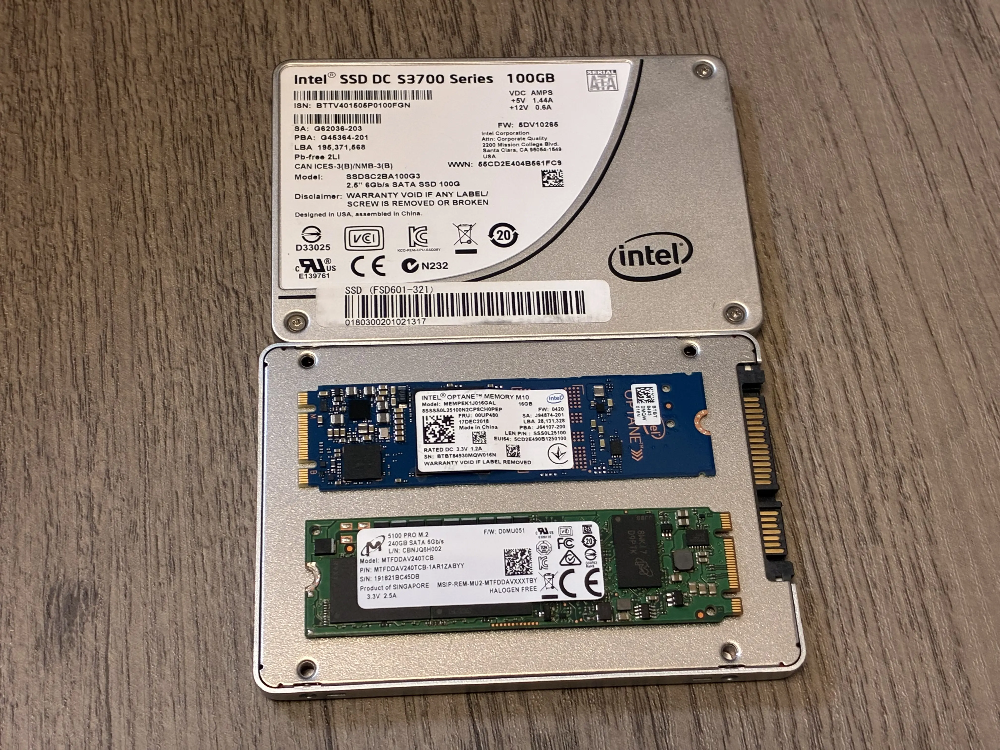

During my adventure to minimize my hardware and reclaim some living space, my NAS was reinstalled into a new chassis that is much smaller than the old one. As a result, I had to choose some new boot drives for the system.

In that process, I had to ask my self some questions.

- Should I mirror the drives in ZFS RAID1?
- Which grade of drives should I use?
- Which ones to use?

This post serves as a recollection to the time I spent arguing to myself about which disk to use for that purpose.

# How important is the boot drive

Boot disks to NAS systems are often an overlooked part of the story, however it also comes with a lot of variety. Low end systems often come with a single M.2 drive, with some model choosing even cheaper solutions such as eMMC. At the same time, higher end systems often come with redundant enterprise grade SSDs, running either in software or hardware RAID.

Of course the enterprise systems will come with the highest grade hardware, as they usually do not want to lose revenue due to system downtime. However, the fact that many NAS systems only come with a single consumer level disk as the boot device has pointed some to believe that the boot device is basically a slot that can be filled with any junk. As always, the truth is somewhere in between.

The importance of the boot drive can be mainly separated into two parts - how important it is for uptime, and how important it is for the safety of your data.

A healthy system drive is important for its uptime. If your device only has one disk that runs the operating system, then when the disk dies, your system will mostly die immediately. In the case that you have set some sort of alert service within that system, it will probably not be able to be executed. Even after you have noticed the failure, ran into the room to replace the failed drive, and reinstalled the OS, you will need to reconfigure the device, either from a backup or from memory. Even ignoring the possible large gap between the failure occuring and it being noticed, that is still a lot of downtime.

A working system drive might also be important to data safety, however in an ideal case it shouldn't be. Normally data in NAS devices are stored in the data disks, however things like the only encryption keys to that data are stored in the boot drives can lead to loss of data, if said boot drives are to fail.

Therefore, as you can see, although a sometimes overlooked piece to the puzzle, the boot drive is still important to a well functioning system.

# RAID is for uptime, not backups

This phrase is said a lot, however it is still worth stressing it.

Why is it true? Imagine a case where an important configuration is stored on a server. RAID keeps everything working even in the case that one of them were to fail, however it does not help when someone deletes the file by mistake. It also will not help in the case that two of them fail at the same time, but even enterprise systems sometiems does that. For example, Patrick from ServeTheHome ran into [this issue](https://www.servethehome.com/9-step-calm-and-easy-proxmox-ve-boot-drive-failure-recovery/) with Proxmox VE. In both cases, you will need a backup.

So the answer to my first question (Should I mirror the drives in ZFS RAID1?) is simple. If you value uptime, then you should **consider** getting mirrored drives.

> Of course, not everything is so simple. In an ideal world everyone can get 3-way mirrors, but there are always constraints such as SSD pricing or available slots on the motherboard.

> The NAS OS I use, TrueNAS, offers the ability to very conveniently export and import the entire configuration as a single file, which means that reconfiguring the system after a reinstall is much easier. However, even in that case RAIDing the drives still offers some benefits. One of them is that it offers uptime, as I had a SATADOM SSD fail and it took me some time to realize that is was the NAS that failed as no email had come through. (Of course you can make an external monitoring system, but that only adds to the complexity.) Another is that in the case you have forgot to backup the configuration after a change.

> There is also the discussion that while software RAID provides some sort of HA, there are still problems with it, such as the system being not able to switch from a failed disk when booting. However, if one disk fails and the system continues working, I am not so stressed about it not booting from the correct drive the next boot, as it probably should have been replaced. See more on this at discussion [here](https://www.truenas.com/community/threads/highly-available-boot-pool-strategy.99319/).

# Consumer vs enterprise grade

That brings us to the next question, which is to use consumer grade SSDs or enterprise grade ones? I know some people that are willing to die than to use consumer SSDs, however my stance in this matter is that although enterprise grade ones are much better, if you can stand using consumer grade ones then it's fine, especially for boot drives.

Although there are still different levels of consumer drives and even more variety in enterprise ones, it most comes down to life expectancy and performance between the two. However, none of those matter for a simple boot disk of NAS systems, which are mostly not written to that much. This is even more true for home users.

IXSystems, the makers of TrueNAS, will probably agree to this, since both of their entry level systems are powered by a SATADOM SSD or a single consumer grade NVMe M.2 SSD. (Refer to reviews of the two, [TrueNAS Mini X Plus](https://www.youtube.com/watch?v=sYl83jcTU4o) and [TrueNAS Mini R](https://www.youtube.com/watch?v=SoH5RSwKsvw)).

> That said, if you don't mind paying more for enterprise drives, go for it. More reliability is better, right?

> I was extreme lucky to have bought some enterprise grade SSDs for dirt cheap, which is why I will be using them. If I didn't have those, I would probably just find some cheap 256GB SSDs on the second hand market.

# The chosen one

Until now we have decided on the first two questions - RAID1, enterprise grade if you can. Now it is time for us to choose one.

I have the following disks "in stock" at my home that can be utilized.

- 16GB Optane M10
- 100GB Intel S3700 SATA 2.5 inch
- 240GB Micron 5100 Pro SATA M.2

This is also what was shown on the featured image at the top of this post, but for ease of viewing I will show them here again.

There is also the necessity to list my NAS hardware.

- Old NAS: 2U rackmount case, roomy enough to shove two S3700 drives in the chassis.
- New NAS: Small chassis, all drive bays will be used by data drives. One 2.5 inch drive bay near motherboard usable.
- Motherboard: Supermicro X11SSM-F, has two PCIe x4 slots usable. No M.2.
- PCIe x4 to M.2 card: supports one M.2 NVMe x4 and one SATA M.2 at the same time.

I used to have two 100GB S3700 drives as my boot drive, however after the chassis transplant there won't be room to fit both of them. Only one mounting slot exists, and there isn't much room for the drive to be dangling around freely in the chassis. That's why I had to choose a new design.

The 16GB Optane drives were a good enough choice for TrueNAS installs. The downsides to it are its size and the fact that it takes PCIe channels. However, with TrueNAS version 26, the minimum requirement for the boot device has increased from 16GB in version 25 ([Source](https://www.truenas.com/docs/scale/25.10/gettingstarted/scalehardwareguide/)) to 20GB ([Source](https://www.truenas.com/docs/scale/26/gettingstarted/tnhardwareguide/)), which means that it is probably not a suitable choice anymore.

Between the Intel S3700 and the Micron 5100 Pro, both of them are great choices for this role. However, for the simple fact that I cannot fit two of them in this chassis, I have chosen to go with two 5100 Pros on adapter cards.

Again, if I didn't have these drives on hand, I will go with random but good enough drives on the second hand market, so there is no need to stress about getting the same or better drives just for boot.

> It might be a good idea to use one Intel S3700 and one Micron 5100 Pro, so there is less chance for them to fail at the same time. However, the chassis is so cramped that even geting the SATA power cable to the drive slot is difficult. Also, RAID is for uptime! In my mind the availability the mirrored Micron drives provide are enough, which is why I did not go with mixed drives.