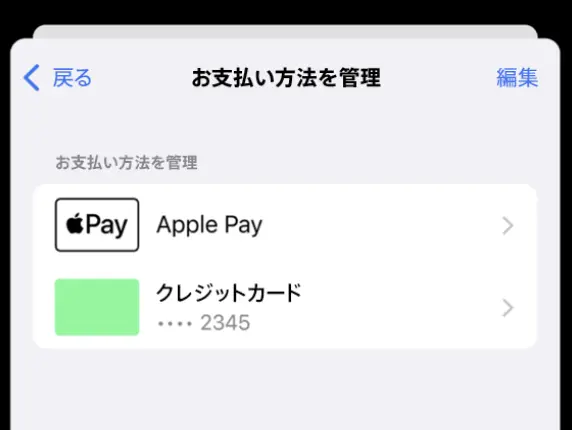

Apple Pay has existed as an payment option for the App Store and Apple Services since 2019 [Source](https://web.archive.org/web/20260717042521/https://www.gizmodo.jp/article/app-store-apple-pay/), and it became available in Japan at somewhere around April 2024. [Source: Payment methods that you can use with your Apple Account](https://support.apple.com/en-us/111741), although I couldn't find any official announcements, compare capture between [10 April 2024](https://web.archive.org/web/20240410051622/https://support.apple.com/en-us/111741) and [18 April 2024](https://web.archive.org/web/20240418171556/https://support.apple.com/en-us/111741).

However, its mechanisms and quirks are very poorly documented by Apple, and there isn't much discussion around it online as well. (From what I can find. It also could be because Google can't differenciate between the "App Store" and the "Apple Store"). That is why I have decided to document some findings I ran into, so that both you and me in the future can understand it better.

> Precisely because of the lack of documentation, the contents of this post can become outdated and inaccurate at any time.

> Note that this is about the "App Store", which offers application purchases, subscriptions, and others. This is different from the "Apple Store", which is where Apple sells their products such as iPhones.

# How to setup

Check whether your account region supports Apple Pay as an option from [here](https://support.apple.com/en-us/111741). If so, follow the steps documented on [Apple's website](https://learn.applepay.apple/en-us/paywithapplepayjp).

After you have set it up, Apple Pay should appear as the default payment method for your account. It is not possible to use another payment method, such as a credit card, as the default, and use Apple Pay as the backup.

At the time of your App Store purchases, you would be prompted by the Apple Pay interface to choose a card and pay. It is similar to the interface when you utilize Apple Pay from a website and not necessarily from the App Store.

# Apple Pay and recurring payments

One time purchases such as applications are easier to understand, as they are not so different from a normal checkout with Apple Pay. However, recurring payments such as subscriptions are a bit different.

Think about it. Apple Pay is secure because it tokenizes each transaction, and requires on device authentication. Doesn't allowing recurring payments with Apple Pay break this security?

At least that's what I thought. Apperantly, most of the above is still true, but instead of authenticating for each charge, you are authenticating for the merchant and their future charges. Let's see how Stripe explains this in their [documentation](https://docs.stripe.com/apple-pay/apple-pay-recurring).

>To make recurring payments, some businesses need to save the Apple Pay payment method on file when a user is on-session then make the recurring payments later when the user is off-session. The first on-session payment is often called a customer initiated transaction (CIT), and the later recurring payments are often called merchant initiated transactions (MIT). Two examples of recurring payments (or MIT) are:
>
>- Subscriptions where users get billed on a fixed frequency.
>- Recurring off-session payments where the billing frequency is inconsistent, or where customers can vary the frequency.
>
>When users interact with the Apple Pay payment sheet, to keep the PAN (the original card number) private, Apple Pay processes a card PAN and generates a Device Primary Account Number (DPAN) or Merchant Token (MPAN) depending on the device OS version and integration. DPANs are tied to the specific Apple device, and can be unintentionally deactivated if a user switches to a new device (for example, an iPhone or an iPad) and adds the same card on it. MPAN is the newly introduced more reliable option for recurring payments. MPANs aren’t deactivated when users switch their devices, and comes with better visibility and lifecycle management features.
>
>Beyond these differences, MPAN and DPAN behave similarly.

This mechanism enables Apple Pay to be utilized for recurring payments, possibly even those with changing charges each time, such as usage based payments. 

# Advantages and quirks for recurring payments

The advatanges are mostly around security and ease of use.

- It avoids providing the merchant with your original card number info, and forcing a user device authentication, which is more secure than some websites who don't check 3-D Secure.
- It also gets rid of the necessity to enter your card number for each service, which can be more convenient.
- Although not limited to recurring payments, the process that requires you to choose a card and authenticate for each site means that you can use different cards for each service, if you are not normally allowed to. This is true for the App Store, where without Apple Pay as an option, your payment methods will be charged from top to bottom. However, with Apple Pay, you get to choose which card to charge each time, so you could use different cards for different genres, as an example.
- Some cards provide more cashback for payments with Apple Pay, and this will count towards that.

There are also some quirks.

- Of course, if the card you wish to use does not support Apple Pay, you are out of luck.
- Subscription management can be quirky. Will elaborate more on this below.
- What happens when your card is deleted in the Wallet app or gets transfered to another device in unknown. Some users have posted about iOS stopping them from deleting it, however whether that is for subscriptions to Apple or a third party is unknown.

About subscription management - normally, to initiate a subscription, you are required to have an account and fill out your details such as an address and card numbers for most websites. However, because Apple Pay can be used to provide all of those info, depending on the website design, you might not have an account at all, which can make unsubscribing difficult.

This is true for donations to the *Internet Archive*, for both traditional credit cards and Apple Pay. You do not get an account, and you will need to write an email to unsubscribe. If this is not preferable to you, manual donations via Apple Pay might be the most secure and untroublesome option to use.

> That being said, I do highly recommend donating to the Internet Archive, as I do believe what they do is important.

# When payments fail

This is not clear from Apple's documentation, so there is some speculating going on here. This only considers subscriptions, as I believe one-time purchases will simply fail without any fallback.

From their help pages, it seems like Apple Pay is considered to be "one option" as a whole by the App Store. And for a purchase, Apple will try to charge all the payment methods recorded on your account.

Because how Apple Pay is always the default option, any subscriptions you initiated with Apple Pay will charge your chosen card with Apple Pay by default. If that fails, the remaining payment methods are charge from top to bottom as a fallback.

However, all of this is not clearly documented and might be inaccurate or change.

# How to switch to Apple Pay for subscriptions

Subscriptions you have initiated not using Apple Pay will continue to charge the remaining payment methods, just as they used to. This is because the authorization has not taken place with Apple Pay.

However, switching is not too hard. Try to cancel said subscription from the App Store before it expires, and instantly renew it. You should be greeted by the option to pay with Apple Pay. In theory the subscription should continue without any disturbance.

# Notes on Paypay

Though not related to Apple Pay, the App Store also allows Paypay, a Japanese payment app, to be used as a payment method for the App Store. However, Paypay accounts are consisted of both a top up balance, and a credit limit if you are approved. It is not clearly documented that wich one of them is charged for App Store purchages, both one-time and subscriptions.