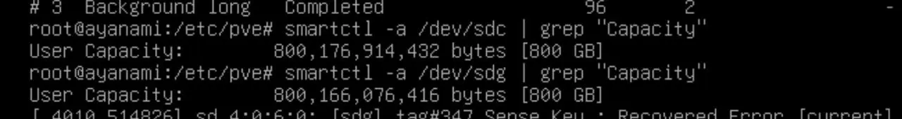
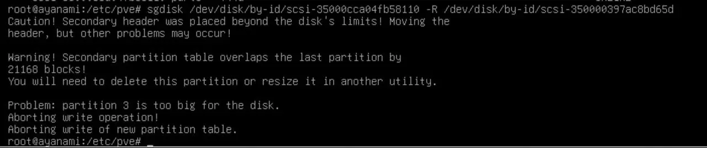

> Although I started trying to achieve what was said in the title, it seems that other actions not supported by ZFS, such as switching between mirror and RAIDZ, change RAIDZ type, or removing RAIDZ devices, can also be achieved by this process, as this essentially recreating a new ZFS pool.

I was recently tasked with swapping out aging boot SAS SSDs inside a Proxmox VE ZFS RAID1 install with newer ones, from 800GB HGST Ultrastar HUSMM1680ASS201 to 800GB Toshiba PX05SMB080Y. Both are performant drives that still have a lot of life left, however the PX05s offer about 3 times the read IOPS, thus the change.

Any sane person would assume the drives to be compatible for a swap, because why would it not be? However, as you know, the world is made of arbitrary decisions and insane people that cannot work together, and we get this problem.



The upper one, `/dev/sdc`, which is the older HGST drives, has a capacity of `800,176,914,432 bytes`, while the lower one, `/dev/sdg`, only has `800,166,076,416 bytes`. That is a difference of 10,838,016 bytes, or about 10MB. However, that is enough to make our task of replacing the drives much harder.

# The official way

> Commands in this part might not be accurate. Refer to the [Proxmox VE Documentation](https://pve.proxmox.com/pve-docs/chapter-sysadmin.html#_zfs_administration) for up to date detailed information.

Replacing drives in ZFS is easy, if the newer drive is the same size or larger than the one being replaced. To do that, the following simple command is used. ([Source](https://pve.proxmox.com/pve-docs/chapter-sysadmin.html#sysadmin_zfs_change_failed_dev))

```
# zpool replace -f <pool> <old-device> <new-device>
```

However, that only covers the ZFS part. With our drives being the boot device, we also have to recreate the BIOS partition and the ESP partition. Luckily Proxmox VE has us covered, as we only need to run the next command.

```
# sgdisk <healthy bootable device> -R <new device>
# sgdisk -G <new device>
# zpool replace -f <pool> <old zfs partition> <new zfs partition>
```

Then either, depending on you are using `proxmox-boot-tool` or `grub`, run the following.

```
With proxmox-boot-tool
# proxmox-boot-tool format <new disk's ESP>
# proxmox-boot-tool init <new disk's ESP> [grub]

With plain GRUB:
# grub-install <new disk>
```

However, this breaks down if we are trying to replace the current drive with smaller ones, as the following error will occur.



This error is reasonable, since we are asking a tool to copy data to somewhere that doesn't exist on the new disk. However, this does mean that we need to do more hands on tinkering.

# The solution

The solution I came up to get around this consists of the following steps.

- Checking what the current install consists of. Partition table, bootloaders, etc.
- Creating a new ZFS pool with the new drives.
- Rebooting into a Proxmox VE install image's terminal.
- ZFS send and receive the data.
- Install bootloader.
- Reboot and final touch up.

> naa0yama's blog shows that you can detach one of the mirrors and attach a new disk to create a new mirror, however this comes with some risk. It also will not work with RAIDZ vdevs as they do not support detaching. The ZFS vdev name also changes from 'mirror-0' to 'mirror-1', which my somewhat OCD brain does not like.

> There are also scripts that help against this, such as this one: [Reddit](https://www.reddit.com/r/Proxmox/comments/1cr6wn7/tutorial_howto_migrate_a_pve_zfs_bootroot_mirror/), [GitHub](https://github.com/kneutron/ansitest/blob/master/proxmox/proxmox-replace-zfs-mirror-boot-disks-with-smaller.sh). You should use it at your own discretion. It also will not work with RAIDZ vdevs.

> Rebooting into a rescue environment instead of doing it live on the system can be more cumbersome, but it has the advantage of not missing any changes between snapshoting and migration.

## Checking current disks

Use `proxmox-boot-tool status` to check which bootloader you are using for boot. Also use `fdisk -l` to see what your partition table looks like. Save it for use later.

## Partioning

We will now partition the new drives. Unless there is a specific reason, it should be a good idea to follow the partition table of the existing install.

At the time of writing, the partition table looks something like this.

|No.|Type|Size|
|---|---|---|
|1|BIOS boot|1M|
|2|EFI System|1G|
|3|Solaris /usr & Apple ZFS|Remaining space|

You can use any partitioning software you like for this task. I am used to `fdisk`. Do this to both disks.

> It might be a good idea to leave some remaining space at the end ot the disk, for example for a swap partition, as it is not recommended to have swap on ZFS. Or it could help in the case that you wish to migrate to a smaller disk, as although the sgdisk -R command will still result in errors about the backup GPT header being unable to be copied, you can fix this afterwards. This is helpful in cases where the exact disk is not guaranteed to be availble.

> sgdisk -R copies the partition table, not the contents of the partitions. If all partition end LBAs fit on the smaller disk, the partition layout can be valid even though the source disk’s backup GPT header is beyond the end of the destination. Afterward, sgdisk -e /dev/sdX can relocate the backup GPT to the end of the smaller disk.

## Rebooting with installer

Prepare a USB drive with the Proxmox VE installer. Make sure to use one that is newer than the system being migrated, as older versions of ZFS software are not able to operate on newer versions of ZFS pools.

> Make sure to not use Ventoy for this, and manually write to a USB drive. See the link in references.

After booting, go to `Install Proxmox (Debug Mode)` under advanced options, and press `CTRL-D` to launch a terminal.

## Transferring the data

We need to mount ZFS, and chroot into it.

```
# zpool import -f -R /mnt rpool
# mount -o rbind /proc /mnt/proc
# mount -o rbind /sys /mnt/sys
# mount -o rbind /dev /mnt/dev
# mount -o rbind /run /mnt/run
# chroot /mnt /bin/bash
```

Create the new ZFS pool. If you need to, add any extra options such as `ashift` or compression here.

```
# zpool create pve mirror /dev/disk/by-id/scsi-XXX0-part3 /dev/disk/by-id/scsi-XXX1-part3
```

After that, we need to create a snapshot for the root filesystem, and send it to the new zfs pool.

```
# zfs snapshot -r rpool@migration
# zfs send -R rpool@migration | zfs receive -v pve -F
```

## Installing bootloader

Thanks to `proxmox-boot-tool`, simply use the following command on both of the new disks.

```
# proxmox-boot-tool format /dev/sda2
# proxmox-boot-tool init /dev/sda2
```

> I believe that it is a good idea to run proxmox-boot-tool from the chroot environment instead of the installer's root.

If for some reason your system uses GRUB, do the following.

```
# update-grub
# grub-install /dev/sda
# grub-install /dev/sdb
```

## Reboot and final steps

Shutdown the system, and remove the old drives. If needed, remove the UEFI boot options to the old disks. Follow the boot process to enter the installer's debug mode again.

Here we need to fix the name of the ZFS pool, as it is still `pve`, when it needs to be `rpool` so nothing has changed from the perspective of the OS.

```
# zpool import -f -R /mnt pve rpool
# zpool export rpool
```

Now you can reboot, and the system should start up as nothing has happened. Afterwards, you can run `proxmox-boot-tool status` and remove the old disk IDs from `/etc/kernel/proxmox-boot-uuids`.

It might be a good idea to keep the old disks around for a while, as the data on there is still intact. After you have verified that the system functions normally, don't forget to securely erase the data on the old drives.

# References

This task was completed successfully thanks to the following content.

- [Binary Impulse: Migrating Proxmox Hypervisor’s Boot Volume ZFS Mirror To New (Smaller) Disks](https://binaryimpulse.com/2023/11/migrating-proxmox-hypervisors-boot-volume-zfs-mirror-to-new-smaller-disks/)
- [naa0yama's Blog: Proxmox VE 8.3 の ZFS MIROR を縮小し SSD を交換する!!](https://blog.naa0yama.com/p/02w17-srcjj0yk/)
- [kneutron/ansitest: proxmox-replace-zfs-mirror-boot-disks-with-smaller.sh](https://github.com/kneutron/ansitest/blob/master/proxmox/proxmox-replace-zfs-mirror-boot-disks-with-smaller.sh)
- [Proxmox Forums: Ventoy install of Proxmox 8.1 halts at "Loading initial ramdisk"](https://forum.proxmox.com/threads/ventoy-install-of-proxmox-8-1-halts-at-loading-initial-ramdisk.143196/)
- [free-pmx: Rescue boot Proxmox VE host](https://free-pmx.org/guides/pve-rescue/)
- [itslukek: Swap from legacy boot to UEFI - Proxmox ZFS](https://gist.github.com/itslukej/50b487514aeb4c215d70646b33d43cb5)