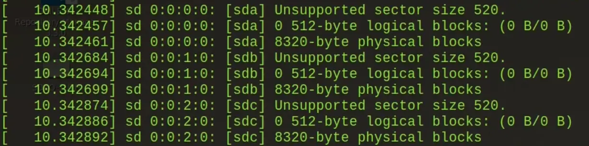
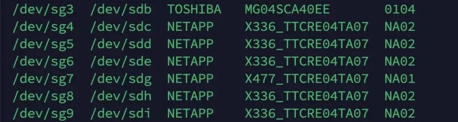

# Updates

## 2026/06/26

> Updated content for clearity.

> Also, it is simply not possible to get neither HDDs and SSDs at reasonable prices now in 2026. Thanks, AI LLMs that doesn't really do much!

Bought some dirt cheap used enterprise SSDs on Yahoo Auction, only to be not able to do anything with them. The 520 byte sector problem.

# The problem

## What's a sector

In computer disk storage, a sector is a subdivision of a track on a magnetic disk or optical disc. In simpler terms, it is the smallest unit of allocation or operation of a disk, to some extend kind like a atom during chemimal reactions. In practice, operations often span across multiple sectors, and data not filling entire sectors will have the remainder of the sector filled with zeros. [Source: [Wikipedia](https://en.wikipedia.org/wiki/Disk_sector)]

Traditionally HDDs have been using 512 byte sectors for a long time, however some modern storage devices has turned to 4KiB sectors for its ability to integrate stronger error correction algorithms to maintain data integrity at higher storage densities, and also to reduce complexity and costs at high storage density.

> We are now starting to see SSDs with sector sizes of 8KiB and even 16KiB, for its advantage of saving on space on the NAND translation table. Still, they are rare occurances.

## Why do some disks use 520 byte sectors?

The main motive here is that the extra bytes could be used for something else. For example, hardware RAID may use it for parity calculations, or special file systems may use it for other purposes.

Sometimes 528 byte sectors are also used, though less common in my experience. Sector sizes around 4KiB also exist, for example 4096, 4112, 4160, and 4224 bytes. For the time being the focus will be put on 520 byte sectors, as the procedure to convert them are essentially the same.

## The problem with 520 byte sectors

The problem is simple - it's not normal. Linux normally cannot read disks formatted with 520-byte sectors. (Nor can Windows.) If you try to use linux with 520 byte sector drive, run dmesg and you might see the following error:



[Source: youtube.com/@ArtofServer](https://youtu.be/DAaTfv96V9w?t=183)

However, this will only show up if the operating system has access to the drives. In my case, connecting 520 byte sector drives to a Dell R730 with a H730p controller, the drives do show up on the controller management page as 520 byte sectors and "RAID ready", however I was unable to do anything with them, nor did the controller pass the drives to the operating system, despite setting the controller in "HBA Mode". Although some info online suggested that flashing a H710 into "IT mode" was able to fix the problem, no workaround for H730/H730p or anything that generation has come up. Thus I was unable to do anything with the drives unless I purchase another HBA card.

In the end I purchased 2 [LSI 9217-8i 2308 HBAs](https://docs.broadcom.com/doc/12352067) for 160 CNY (around 20 USD at the time) on Taobao. As a bonus the cards were already flashed into IT mode, reducing my pain. IT mode basically means that instead of functioning as a RAID controller, the card will passthrough the disks without any modification. Though the HBA mode on my H730p should have functioned the same, for some hiccup or another the H730p did not pass it through. I ended up using the cards on another machine that did not have a build-in SAS controller but only a SATA one, so I guess the purchase is not wasted afterall.

> It does seem to be a firmware issue. Due to the disks being in 520B, the H730p firmware thinks that they are in an RAID array, however because the disks do not have the Dell RAID partitions, the H730p fiwmare freaks out and can not do anything about them, neither editing them from a RAID standpoint, nor passing them through to the OS. I believe the H330 and H730 firmwares are the same, though I have not tested them. The HBA330, running SAS-3008 IT mode firmware, which is a plain passthrough HBA, is able to pass the disks to the OS. The H330 can be flashed with HBA330 firmware, and the H330 mini can be flashed to a HBA330 mini with no problem.

> As of 2026 you should really be buying SAS-3008 series HBAs, if not even newer versions. You gain much more performance and future compatibility, while the difference in price and power usage are small. Take a look at these videos by [Art of Server on YouTube](https://www.youtube.com/@ArtofServer): [***"Watch this if you're new to HBA IT mode SAS controllers"***](https://youtube.com/playlist?list=PL28eVGz5vFQ8lmttOxL17QwJ3KJp05wi6).

## Why did you buy those disks then? Should I buy them?

The main selling point of these drives are that they are just cheap. Why are they cheap then? Well - 

- The 520 byte sector problem.
- They're old. In fact the drives I picked up were more than a decade old as of time writing. (Manufactured in week 52 of year 2012 - Data from S.M.A.R.T.)

> Well they are not *necessarily* old, but most of the systems can utilize the non-standard sector sizes are enterprise systems, and a lot of enterprises generally only upgrade their systems at end-of-life, so around 5 years. That is often also the amount of time for a SSD to be considered obsolete, or for the risk of a HDD failing to rise.

But they also have pros - 

- They are enterprise grade drives, so you enjoy all the enterprise-level stuff, like SAS, power-loss protection, and a very high level of endurance. Some drives I picked up only had a few terabytes written, while two drives which had 800+TBs written only used ~4% endurance.
- They are also pure MLC, so no slowdowns with consumer level TLC and QLC drives.
- Same or better performance than buying brand new, but sometimes with 1/4-1/3 of the cost.

Should you buy them? Well if you're just a "normal" person planning your next PC build, I would probably say, no. It's still a lot of effort to get something like this working, let alone the specific parts and hardware. I still just use consumer NVMe SSDs in my personal PC. But if you're building your "homelab" with already enterprise grade servers, then why not. Still, the choice is up to you.

But then again, come to think of it, no "normal" person should probably be reading this.

# The fix

Basically the fix will just be to reformat the drives into 512 byte sectors.

## Prerequisites

I would recommend using Linux for the operation. In my opinion booting a live Ubuntu USB and using it is much simpler than Windows. However, Windows will still work for this.

Fire up the terminal with root privileges. We will be using `sg3-utils` and `smartmontools`.

```
apt update && apt install sg3-utils smartmontools
```

Run `sg_scan -i` to see if your drives show up. If they don't, then you have other problems to fix.

```
root@ubuntu:~# sg_scan -i
/dev/sg0: scsi0 channel=0 id=0 lun=0
    NETAPP    X446_RALS200MCHT  NA02 [rmb=0 cmdq=1 pqual=0 pdev=0x0] 
/dev/sg1: scsi0 channel=0 id=1 lun=0
    NETAPP    X446_RALS200MCHT  NA02 [rmb=0 cmdq=1 pqual=0 pdev=0x0] 
/dev/sg2: scsi0 channel=0 id=2 lun=0
    HITACHI   HUSMM118 CLAR800  C250 [rmb=0 cmdq=1 pqual=0 pdev=0x0] 
/dev/sg3: scsi0 channel=0 id=3 lun=0
    HITACHI   HUSMM118 CLAR800  C250 [rmb=0 cmdq=1 pqual=0 pdev=0x0] 
/dev/sg4: scsi0 channel=0 id=32 lun=0
    DP        BP13G+EXP         3.35 [rmb=0 cmdq=1 pqual=0 pdev=0xd] 
/dev/sg5: scsi10 channel=0 id=0 lun=0 [em]
    HL-DT-ST  DVD-ROM DTA0N     D3C0 [rmb=1 cmdq=0 pqual=0 pdev=0x5]
```

Identify your drives. Use `lsblk` and `smartctl --all /dev/sgX` to find the right drive. **Like any other formatting operation, you will lose all the data on the drive you're formatting. Precede with your own caution.**

## Formatting

Just like any other thing, using 512 byte sectors with a disk will require the disk's firmware to support it. Older drives might require a firmware re-flash. If you need to do this, consolidate the web. However, most modern drives since 2012 ([source](https://forum.level1techs.com/t/how-to-reformat-520-byte-drives-to-512-bytes-usually/133021)) will support 512, 520 and other sector sizes with the same firmware. For example, the HITACHI Ultrastar SSD1600MMs clearly states that it does support 512, 520, 528, and 4K sector sizes in its [datasheet](https://documents.westerndigital.com/content/dam/doc-library/en_us/assets/public/western-digital/product/data-center-drives/ultrastar-sas-series/data-sheet-ultrastar-ssd1600mm.pdf), with the Ultrastar SSD400Ms supporting both 512 and 520 sector sizes, though not listed in its [datasheet](https://documents.westerndigital.com/content/dam/doc-library/en_us/assets/public/western-digital/product/data-center-drives/ultrastar-sas-series/data-sheet-ultrastar-ssd400m.pdf). This will come bite me back later. Anyhow, getting something old enough to not support 512 byte sectors out of the box is probably not worth the effort.

We will use the `sg_format` utility for formatting. The command goes

```
sg_format /dev/sgX
```

This will give information regarding the disk, such as

```
root@ubuntu:~# sg_format /dev/sg1
    NETAPP    X446_RALS200MCHT  NA02   peripheral_type: disk [0x0]
      << supports protection information>>
      Unit serial number: XXVAV10A        
      LU name: 5000cca01313b5bc
Mode Sense (block descriptor) data, prior to changes:
  Number of blocks=390721968 [0x1749f1b0]
  Block size=520 [0x208]
Read Capacity (10) results:
   Number of logical blocks=390721968
   Logical block size=520 bytes
No changes made. To format use '--format'. To resize use '--resize'
```

To actually format it, you will need to use the `--format` option. **There is no going back if the operation has started. You will have 15 seconds to cancel after you press enter. Precede at your own risk.** The follwing code only serves as an example.

```
root@ubuntu:~# sg_format -v --format --size=512 /dev/sgX
    SanDisk   DOPE1920S5xnNMRI  3P01   peripheral_type: disk [0x0]
      PROTECT=1
      << supports protection information>>
      Unit serial number: 00028FA6
      LU name: 50011731004624c0
    mode sense (10) cdb: 5a 00 01 00 00 00 00 00 fc 00 
Mode Sense (block descriptor) data, prior to changes:
  Number of blocks=3750748848 [0xdf8fe2b0]
  Block size=512 [0x200]

A FORMAT UNIT will commence in 15 seconds
    ALL data on /dev/sg2 will be DESTROYED
        Press control-C to abort
```

> Depending on the firmware and how the drive is designed, the formatting might finish quickly, or it might take a while. In my experience, generally HDDs need to have the entire disk rewritten, so about 8 hours for a 4TB drive. (150MiB/s @ 7.76Hrs)

> If you choose to Control-C to exit out of the program, the formatting will still continue in the background. This allows you to do other things, including formatting multiple drives in parallel. You can check for a progress of a certain drive with `sg_format -v /dev/sgX`.

## What if it doesn't want to format?

For example, something like this will come up

```
root@ubuntu:~# sg_format -v --format --size=512 /dev/sgX
    SanDisk   DOPE1920S5xnNMRI  3P01   peripheral_type: disk [0x0]
      PROTECT=1
      << supports protection information>>
      Unit serial number: 00028FA6
      LU name: 50011731004624c0
    mode sense (10) cdb: 5a 00 01 00 00 00 00 00 fc 00 
Mode Sense (block descriptor) data, prior to changes:
  Number of blocks=3750748848 [0xdf8fe2b0]
  Block size=520 [0x208]
    mode select (10) cdb: 55 11 00 00 00 00 00 00 1a 00 
mode select (10):
Fixed format, current; Sense key: Illegal Request
Additional sense: Parameter list length error
  Sense Key Specific: Error in Data parameters: byte 0
MODE SELECT command: Illegal request sense key, apart from Invalid opcode
```

This is just the drive's smart way of telling you that this is destructive. You can use `dd` to zero the device out first, or you can just `sg_format` them to 520 byte sectors first.

```
sg_format -v --format --size=520 /dev/sgX
```

After that, you can `sg_format` then to 512 byte sectors.

## Confirming the results

Using `smartctl --all /dev/sgX` we can check the sector sizes after the format. For example

```
root@ubuntu:~# smartctl --all /dev/sg2
smartctl 7.3 2022-02-28 r5338 [x86_64-linux-6.2.16-3-pve] (local build)
Copyright (C) 2002-22, Bruce Allen, Christian Franke, www.smartmontools.org

=== START OF INFORMATION SECTION ===
Vendor:               HITACHI
Product:              HUSMM118 CLAR800
Revision:             C250
Compliance:           SPC-4
User Capacity:        800,176,914,432 bytes [800 GB]
Logical block size:   512 bytes
Physical block size:  4096 bytes
LU is resource provisioned, LBPRZ=1
Rotation Rate:        Solid State Device
Form Factor:          2.5 inches
Logical Unit id:      0x5000cca04fb58110
Serial number:        0RY6UEWA
Device type:          disk
Transport protocol:   SAS (SPL-4)
Local Time is:        Mon Sep 18 19:01:10 2023 JST
SMART support is:     Available - device has SMART capability.
SMART support is:     Enabled
Temperature Warning:  Enabled

=== START OF READ SMART DATA SECTION ===
SMART Health Status: OK

Percentage used endurance indicator: 4%
Current Drive Temperature:     28 C
Drive Trip Temperature:        70 C

Accumulated power on time, hours:minutes 45063:15
Manufactured in week 42 of year 2016
Specified cycle count over device lifetime:  0
Accumulated start-stop cycles:  0
Specified load-unload count over device lifetime:  0
Accumulated load-unload cycles:  0
Elements in grown defect list: 0

Vendor (Seagate Cache) information
  Blocks sent to initiator = 50707552

Error counter log:
           Errors Corrected by           Total   Correction     Gigabytes    Total
               ECC          rereads/    errors   algorithm      processed    uncorrected
           fast | delayed   rewrites  corrected  invocations   [10^9 bytes]  errors
read:          0        0         0         0          0     723754.391           0
write:         0        0         0         0          0     818404.477           0

Non-medium error count:        0

No Self-tests have been logged
```

## But what about 4K sectors?

Advanced Format (AF) is any disk sector format used to store data on magnetic disks in hard disk drives (HDDs) that exceeds 528 bytes per sector, frequently 4096, 4112, 4160, or 4224-byte (4 KB) sectors. [Source: Wikipedia](https://en.wikipedia.org/wiki/Advanced_Format)

If it's the new modern thing, than it must be better, right? Well, not always.

Remember how I said that the Ultrastar SSD400Ms not clearly labeling supported sector sizes will come back to bite me? Well, after trying to reformat them to 4096, aka 4K sectors, the formating succeeded without problem. However, I was unable to do anything to the disks. The disks still showed up in system, but anything as small as partitioning failed. After reverting them back to 512 byte sectors, everything worked fine, though S.M.A.R.T reports as `Logical block size:   512 bytes Physical block size:  4096 bytes`. But on the newer Ultrastar SSD1600MMs, they still worked fine with 4K sectors.

> Now that I look at this, the SSD400Ms seem to have some kind of Netapp firmware, so it could be a firmware issue. However, at time of this update I have already sold these drives, so I can't really test it.

But what about performance? I expected performance to increase with 4K sectors, but it seemed to have actually decreased. Online sources divide on this topic, with some saying a increase while some say no noticeable differences. Considering that the older Ultrastar SSD400Ms are in 512 byte sectors, how the Ultrastar SSD1600MMs came in 512 byte sectors, as well as how my comsumer Kioxia NVMe SSDs worked fine in 512 byte sectors, I have decided to keep them in 512 byte mode. I guess it's just not worth the hassle.

I do believe that the operation in not destructive toward the firmware, so you can try it out yourself. **Still, your mileage may very. Precede at your own risk.**

> Generally modern systems/software work fine with both 512 and 4096 sector sizes, and a disk with 4096 physical block sizes should work fine even when formatted to 512, if the firmware does support it. In theory, the disks could have lower random IO performance with 512 sectors, however this rarely matters. For futureproofing, you should design your software/system to be able to work with 4096 sectors, for example, using ashift=12 on ZFS systems.

> Why ashift=12 works on both 512 and 4096 disks? With the default of ashift=9 as it was when ZFS was released, as nobody predicted a future where sector sizes aren't 512, ZFS organizes the underlying disk operations to a size of 2^9=512 bytes, perfectly fitting the disk's physical layers. With ashift=12, the writes are organized with a size of 2^12=4096. The problem arises when trying to use 512 byte writes on a physically 4096 byte disk, as ZFS needs to erase and rewrite the entire 4KiB to write one 512 byte operation. You could see how it will take 4 operations instead of 1 for a sequential write of 4KiB, leading to both performance and disk indurance issues.

> In 2026 I have aquired some Ultrastar SS300 HUSMM3280ASS201 SAS SSDs with IBM branding and IBM firmware B16D. In theory SS300 SSDs should be able to be formatted to both 512 and 4K sector sizes, however the IBM firmware on them does not allow formatting to 512, giving errors about the input value. I do not believe that they are inherently different from regular SS300s from a hardware standpoint, so IBM must has done something to its firmware. Still, modern OSes are able to work with 4Kn disks, as in general you should prepare for the future which may see 4Kn disks only.

# About drives with OEM firmware

As mentioned above, the usability of the drives depend heavily on the firmware that they have. Newer firmware versions may come with general quality of life fixes, extend the drives potential life time, or sometimes even prevent the drives from bricking entirely like [that one time with Samsung drives](https://www.zdnet.com/article/hpe-says-firmware-bug-will-brick-some-ssds-starting-october-this-year/).

I have found great success with finding firmware files from these places.

- [HDDGURU](https://hddguru.com)
- [GitHub: ItsMly/ssd-firmware](https://github.com/ItsMly/ssd-firmware)

The manufacturers that are the most open to providing firmware updates are probably Intel/Solidigm, Dell, and Micron.

- Traditional NAND Intel SSDs either use the ISDCT tool (latest version 3.0.27) or the Solidigm Storage Tool (latest version 2.6/2.7, refer to release notes). Drives that are still supported after Intel SSDs became Solidigm might have newer versions in the SST, such as the D3-S4510/S4610. Newer versions of the ISDCT removed support for non-Optane drives, and newer versions of the SST has removed firmware updates for EOL products.
- Dell provides BIN packages that is compatible with RHEL, and sometimes can be run on Fedora and other RHEL compatible distrubutions. Releases that are too old might not run on newer versions of Fedora. Therefore, when searching for firmware, try to enter from a newer Poweredge server's support page, as EOL servers might not show the newest firmware release. For example, the support page for R750 only shows version KU45 for the HUS726040ALS210, released in 2021, which won't run on newer versions of Fedora. The support page for R760 shows version KU46, released in 2025, and can be run.
- At the time Micron allows free download of firmware files on their site, though it requires an account.

> Honestly I believe manufacturers should release the firmware files freely, at least when they are EOL.

## How to upgrade firmware

### SAS drives

For SAS drives, the utility `sg_write_buffer` is used. Usually the command is used like this.

```
sg_write_buffer -vvvvv -m 5 --in FW_FILE /dev/sgX
```

`-vvvvv` makes the output verbose, and `--in` chooses the firmware file. `-m 5` chooses the mode for the operation, with 5 meaning "Download microcode, save, and activate". [Source](https://docs.oracle.com/cd/F16635_01/html/E72377/sg-write-buffer-8.html)

If the firmware file is not compatible with the chosen drive, the drive should reject it, and this command will fail. I have yet to brick a drive with the incorrect firmware, but again, try at your own risk.

> OEM versions that have custom firmware rarely allow crossflashing to non-custom firmware. This is probably for vendor lockin and selling support contracts.

> However, as a rare case, the MG04SCA series from Toshiba actually allows cross flashing! I have been able to flash some Netapp X336/X477 drives to the normal MG04SCA40EE firmware. Thanks, Toshiba, for doing something good!



### SATA drives

```
hdparm --yes-i-know-what-i-am-doing --please-destroy-my-drive --fwdownload FW_FILE /dev/sdX
```

Make sure that the drive is correct, and that `--yes-i-know-what-i-am-doing`. Although the flag `--please-destroy-my-drive` is used here, the data on that drive should not be changed, as this is only to mean that in the case that the drive is accidentally bricked, you could lose your drive.

# References & Sources

- [Level1Techs: How to reformat 520 byte drives to 512 bytes (usually)](https://forum.level1techs.com/t/how-to-reformat-520-byte-drives-to-512-bytes-usually/133021)
- [Wikipedia: Disk Sector](https://en.wikipedia.org/wiki/Disk_sector)
- [Wikipedia: Advanced Format](https://en.wikipedia.org/wiki/Advanced_Format)
- [YouTube: Art of Server](https://youtu.be/DAaTfv96V9w)
- [NetApp の HDD(SAS/520byteセクタ) をフォーマットして使えるようにしたい!](https://nakoruru.jp/format_netapp_hdd_sas_520byte_sector_so_that_it_can_be_used/)
- [ServerFault: How does OS read disks that were formatted as 520?](https://serverfault.com/questions/1025239/how-does-os-read-disks-that-were-formatted-as-520)
- [dannyda.com: What are IT mode, HBA mode, RAID mode in (SAS) Controllers?](https://dannyda.com/2021/09/22/what-are-it-mode-hba-mode-raid-mode-in-sas-controllers/)